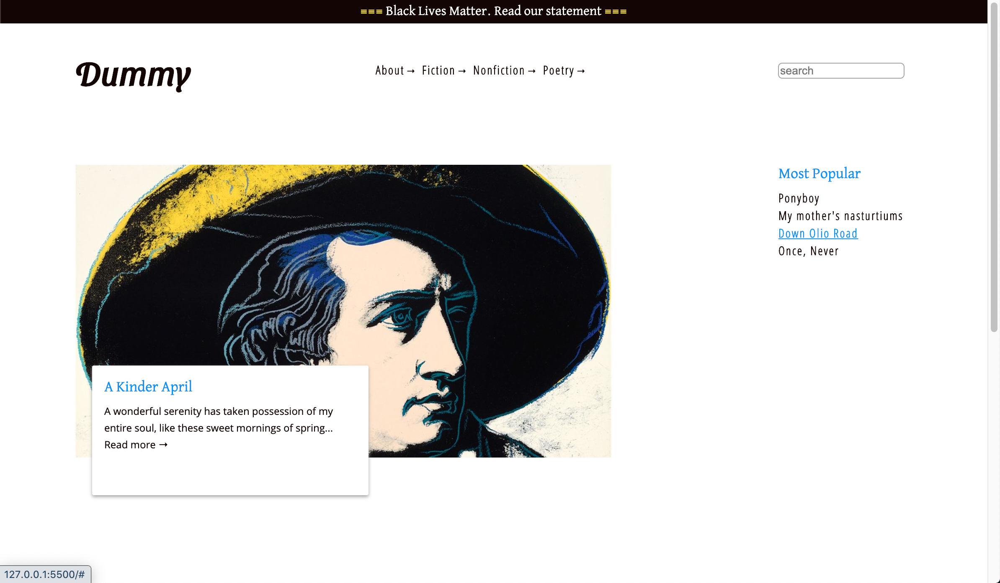
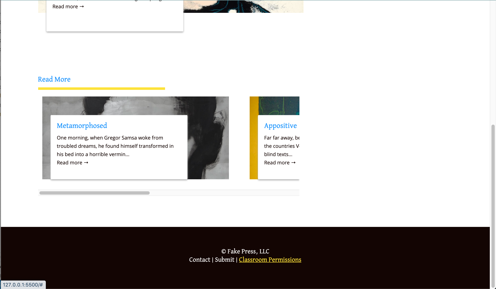
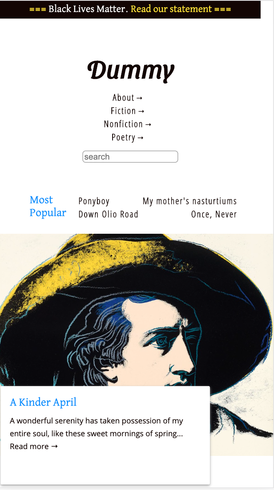
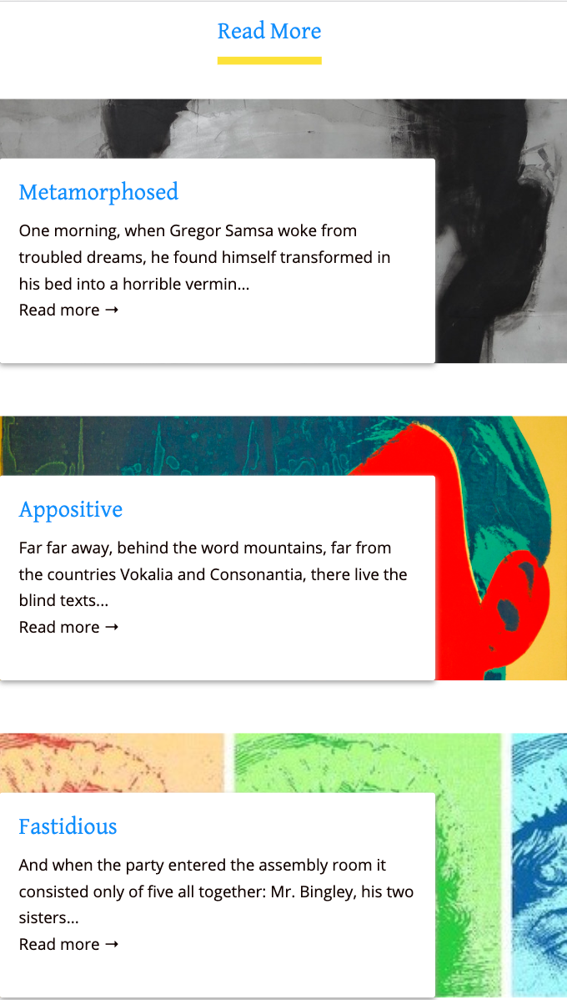

# Dummy Mag

Dummy Mag is a mock blog for an online literary magazine. It was built using HTML, CSS, and JavaScript.

## View Site

[Continuous deployment on Netlify](https://elegant-northcutt-fd1406.netlify.app/) 

## Screenshots

### Desktop

### Mobile

